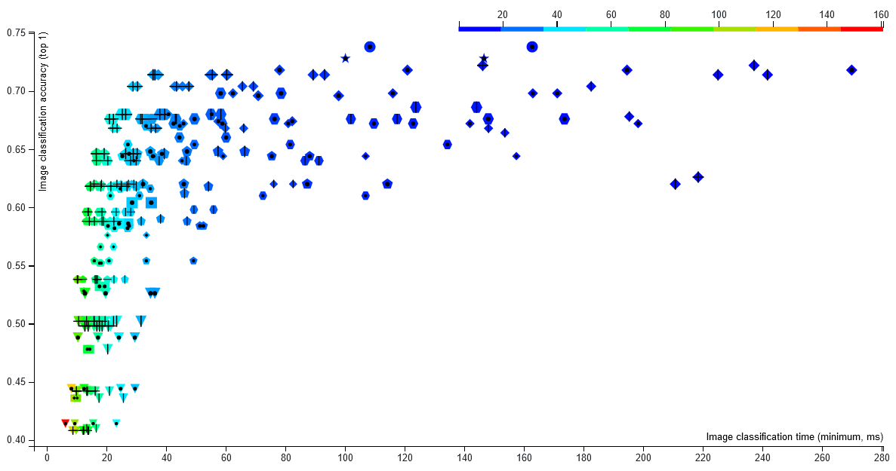
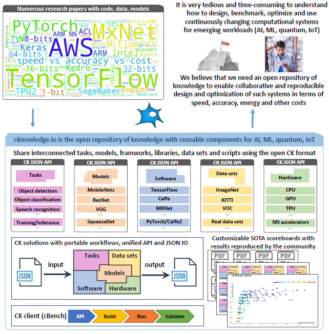

# CK basics

## Project overview

* Philosophical Transactions of the Royal Society: [paper](https://doi.org/10.1098/rsta.2020.0211), [shorter pre-print](https://arxiv.org/abs/2006.07161)

[](https://youtu.be/7zpeIVwICa4)


## Why CK?

While working in large R&D projects with multiple partners to design efficient machine learning systems, 
we face the same problems over and over again:

* When we find an interesting GitHub project, a Jupyter/Colab notebook, or a Docker file from a research paper,
  we want to test it with different data, models, libraries, and AI frameworks.
  We may also want to compare it with another project or integrate it with some continuous integration service,
  or even rebuild it with a different compiler to run on a different hardware.
  However, we quickly get lost in the structure of the project, scripts, and APIs,
  and spend too much time trying to figure out how to make it compatible with different software and hardware, 
  and how to plug in different datasets and models
  while correctly setting up numerous paths and variables. 
  Eventually, we either give up or we manage to customize and run it 
  but then we often struggle to reproduce and compare results (speed, throughput, accuracy, energy, costs).
  By that time, we most likely have to look at another project while facing the same problems again.

* We want to reuse some data, code, and models from our own project or from the project we participated in a few years ago,
  but we already forgot the details and scripts while the readme files and comments are too vague,
  our colleagues or students have left the project, and we either give up 
  or start reimplementing everything from scratch.

Eventually, we realized that a possible solution is to organize software projects and folders as a database
of components (algorithms, datasets, models, frameworks, scripts, results from experiments, papers, etc) 
with extensible JSON meta descriptions. 
In such case we can have a simple tool to automatically find all related components 
from all projects. We can also implement common automation actions for related components 
that can be reused across different projects due to a unified API and CLI.
We can even implement workflows from these actions that can automatically 
find and plug in all related components from all compatible projects thus
minimizing manual interventions and providing a common interface for all shared projects and components.

We called this project Collective Knowledge (CK) because it helps users share their knowledge, experience,
and best practices as reusable automation actions and components with a common API and meta description.
Interestingly, the CK concept enables FAIR principles (findability, accessibility, interoperability, and reusability)
published in this [Nature article](https://www.nature.com/articles/sdata201618).


## What is CK?

We have developed the [Collective Knowledge framework (CK)](https://github.com/mlcommons/ck) 
as a small Python library with minimal dependencies to be very portable 
and have the possibility to be implemented in other languages such as C, C++, Java, and Go.
The CK framework has a unified command line interface (CLI), a Python API,
and a JSON-based web service to manage ***CK repositories***
and add, find, update, delete, rename, and move ***CK components***
(sometimes called ***CK entries*** or ***CK data***).

CK repositories are human-readable databases of reusable CK components that can be created 
in any local directory and inside containers, pulled from GitHub and similar services, 
and shared as standard archive files.
CK components simply wrap user artifacts and provide an extensible JSON meta description
with [***common automation actions***](https://cknow.io/actions) for related artifacts.

***Automation actions*** are implemented using [***CK modules***]( https://cknow.io/modules ) - Python modules 
with functions exposed in a unified way via CK API and CLI 
and using extensible dictionaries for input/output (I/O).
The use of dictionaries makes it easier to support continuous integration tools
and web services and extend the functionality while keeping backward compatibility.
The unified I/O also makes it possible to reuse such actions across projects
and chain them together into unified pipelines and workflows.

Since we wanted CK to be non-intrusive and technology neutral, we decided to use 
a simple 2-level directory structure to wrap user artifacts into CK components:


The root directory of the CK repository contains the ``.ckr.json`` file to describe this repository 
and specify dependencies on other CK repositories to explicitly reuse their components and automation actions. 

CK uses ``.cm`` directories similar to ``.git`` to store meta information of all components 
as well as Unique IDs of all components to be able to find them even 
if their user-friendly names have changed over time (***CK alias***).

***CK modules*** are always stored in ***module / < CK module name >*** 
directories in the CK repository.
For example, ``module/dataset`` or ``module/program``.
They have a ``module.py`` with associated automation actions (for example, ``module/dataset/module.py`` or ``module/program/module.py``).
Such approach allows multiple users to add, improve, and reuse
common automation action for related components rather than
reimplementing them from scratch for each new project.


CK components are stored in ***< CK module name > / < CK data name >*** directories.
For example, ``dataset/text1234-for-nlp`` or ``dataset/some-images-from-imagenet``. 

Each CK component has a ``.cm`` directory with the ``meta.json`` file 
describing a given artifact and ``info.json`` file to keep the provenance 
of a given artifact including copyrights, licenses, creation date, 
names of all contributors, and so on.

CK framework has an internal [***default CK repository***]( https://github.com/mlcommons/ck/tree/master/ck/repo ) 
with [***stable CK modules***](https://github.com/mlcommons/ck/tree/master/ck/repo/module) and the most commonly used automation actions
across many research projects.
When CK framework is used for the first time, it also creates a ***local CK repository***
in the user space to be used as a scratch pad.


CK provides a simple command line interface similar natural language to manage CK repositories, entries, and actions:
```bash
ck <action> <CK module name> (flags) (@input.json) (@input.yaml)
ck <action> <CK module name>:<CK entry name> (flags) (@input.json or @input.yaml)
ck <action> <CK repository name>:<CK module name>:<CK entry name>
```

The next example demonstrates how to compile and run the shared automotive benchmark
on any platform, and then create a copy of the ***CK program component***:

```bash
pip install ck

ck pull repo:mlcommons@ck-mlops

ck search dataset --tags=jpeg

ck pull repo:ctuning-datasets-min

ck search dataset --tags=jpeg

ck search program:image*

ck find program:image-corner-detection

ck load program:image-corner-detection --min

ck help program

ck compile program:image-corner-detection --speed
ck run program:image-corner-detection --env.OMP_NUM_THREADS=4

ck run program --help

ck cp program:image-corner-detection local:program:new-program-workflow

ck find program:new-program-workflow

ck benchmark program:new-program-workflow --record --record_uoa=my-test

ck replay experiment:my-test

```

The [CK program module](https://cknow.io/c/module/program) describes dependencies on software detection plugins 
and meta packages using simple tags with version ranges that the community has agreed on:

```json
 {
   "compiler": {
     "name": "C++ compiler",
     "sort": 10,
     "tags": "compiler,lang-cpp"
   },
   "library": {
     "name": "TensorFlow C++ API",
     "no_tags": "tensorflow-lite",
     "sort": 20,
     "version_from": [1,13,1],
     "version_to": [2,0,0],
     "tags": "lib,tensorflow,vstatic"
   }
 }
```


CK also provides a Python library with a simple API that can be easily used in web applications or continuous integration services:
```python
import ck.kernel as ck

# Equivalent of "ck compile program:image-corner-detection --speed"
r=ck.access({'action':'compile', 'module_uoa':'program', 'data_uoa':'image-corner-detection', 
             'speed':'yes'})
if r['return']>0: return r # unified error handling 

print (r)

# Equivalent of "ck run program:image-corner-detection --env.OMP_NUM_THREADS=4
r=ck.access({'action':'run', 'module_uoa':'program', 'data_uoa':'image-corner-detection', 
             'env':{'OMP_NUM_THREADS':4}})
if r['return']>0: return r # unified error handling 

print (r)

```


Based on the feedback from our users, we have recently developed an open ***CK platform***
to help the community share CK components, create live scoreboards,
and participate in collaborative experiments: [cKnowledge.io](https://cknow.io).

* We suggest you to read this [nice blog post](https://michel.steuwer.info/About-CK/) from Michel Steuwer about CK basics!
* You can find a partial list of CK-compatible repositories at [cKnowledge.io/repos](https://cknow.io/repos).


## How CK supports collaborative and reproducible ML&systems research

It is a very tedious, ad-hoc, and time consuming process to design complex computational systems 
that can run AI, ML, and other emerging workloads in the most efficient way 
due to continuously changing software, hardware, models, data sets, and research techniques.

The first reason why we have developed CK was to connect our colleagues, students, researchers, and engineers
from different workgroups to collaboratively solve these problems and decompose complex systems and research projects
into [reusable, portable, customizable, and non-virtualized CK components](https://cknow.io/browse)
with unified [automation actions, Python APIs, CLI, and JSON meta description](https://cknow.io/actions).

We used CK as a common playground to prototype and test different abstractions and automations of many ML&systems tasks
in collaboration with our great [academic and industrial partners](https://cknow.io/partners)
while agreeing on APIs and meta descriptions of all components.
Over years the project grew from several core CK modules and abstractions 
to [150+ CK modules](https://cknow.io/modules) with [600+ actions](https://cknow.io/actions)
automating typical, repetitive, and tedious tasks from ML&systems R&D.
See this [fun video](https://youtu.be/nabXHyot5is) 
and the [knowledge graph](https://cknow.io/kg1) 
showing the evolution of CK over time.


For example, CK now features actions for 
[software detection](https://cknow.io/soft), 
[package installation](https://cknow.io/packages) 
and [platform/OS detection](https://cknow.io/c/os)
to automate the detection and installation of [all the dependencies](https://cknow.io/c/solution/mlperf-inference-v0.5-detection-openvino-ssd-mobilenet-coco-500-linux/#dependencies) 
including data sets and models required by different research projects.

Thanks to unified automation actions, APIs, and JSON meta descriptions of such components,
we could apply the DevOps methodology to connect them
into platform-agnostic, portable, customizable, and reproducible
[program pipelines (workflows)](https://cknow.io/programs).
Such workflows can automatically adapt to evolving environments, models, data sets, and non-virtualized platforms
by automatically detecting the properties of a target platform,
finding all required components on a user platform using [CK software detection plugins](https://cknow.io/soft)
based on the list of [all dependencies](https://cknow.io/solution/demo-obj-detection-coco-tf-cpu-benchmark-linux-portable-workflows/#dependencies),
installing missing components using [portable CK meta packages](https://cknow.io/packages),
building and running code, and unifying and testing outputs.

Eventually, CK helped to connect researchers and practitioners to collaboratively co-design, benchmark, optimize, and validate 
novel AI, ML, and quantum techniques using the [open repository of knowledge](https://cknow.io)
with [live SOTA scoreboards](https://cknow.io/sota)
and [reproducible papers](https://cknow.io/reproduced-papers).
Such scoreboards can be used to find and rebuild the most efficient AI/ML/SW/HW stacks
on a [Pareto frontier](https://cKnowledge.org/request)
across diverse platforms from supercomputers to edge devices
while trading off speed, accuracy, energy, size, and different costs.
Stable and optimized CK workflows can be then deployed inside Docker and Kubernetes 
to simplify the integration and adoption of innovative technology in production.



Our goal is to use the CK technology to bring DevOps principles to ML&systems R&D,
make it more collaborative, reproducible, and reusable, 
enable portable MLOps, and make it possible to understand [what happens]( https://cknow.io/solution/demo-obj-detection-coco-tf-cpu-benchmark-linux-portable-workflows/#dependencies ) 
inside complex and "black box" computational systems.

Our dream is to see portable workflows shared along with new systems, algorithms, and [published research techniques](https://cknow.io/events)
to be able to quickly test, reuse and compare them across different data sets, models, software, and hardware!
That is why we support related reproducibility and benchmarking initiatives
including [artifact evaluation](https://cTuning.org/ae), 
[MLPerf&trade;](https://mlperf.org), [PapersWithCode](https://paperswithcode.com),
and [ACM artifact review and badging](https://www.acm.org/publications/policies/artifact-review-badging).




## CK platform


* [cKnowledge.io](https://cknow.io): the open portal with stable CK components, workflows, reproduced papers, and SOTA scoreboards for complex computational systems (AI,ML,quantum,IoT):
  * [**Browse all CK ML&systems components**](https://cknow.io/?q=mlsystems)
  * [Browse CK compatible repositories]( https://cknow.io/repos )
  * [Browse SOTA scoreboards powered by CK workflows](https://cknow.io/reproduced-results)
  * [Browse all shared CK components](https://cknow.io/browse)
* [Check documentation](https://cknow.io/docs)
* [Our reproducibility initiatives for systems and ML conferences](https://cTuning.org/ae)


## CK showroom

### CK-powered workflows, automation actions, and reusable artifacts for ML&systems R&D

* [Real-world use-cases](https://cKnowledge.org/partners)
* Reproducibility initiatives: [[methodology](https://cTuning.org/ae)], [[events](https://cknow.io/events)]
* Showroom (public projects powered by CK):
  * [MLPerf&trade; automation suite](https://github.com/mlcommons/ck-mlops)
  * Student Cluster Competition automation: [SCC18](https://github.com/ctuning/ck-scc18), [digital artifacts](https://github.com/ctuning/ck-scc)
  * ML-based autotuning project: [reproducible paper demo](https://cknow.io/report/rpi3-crowd-tuning-2017-interactive),  [MILEPOST]( https://github.com/ctuning/reproduce-milepost-project )
  * [Quantum hackathons](https://cKnowledge.org/quantum)
  * [ACM SW/HW co-design tournaments for Pareto-efficient deep learning](https://cKnowledge.org/request)
  * Portable CK workflows and components for ML Systems: https://github.com/mlcommons/ck-mlops
  * [GUI to automate  ML/SW/HW benchmarking with MLPerf example (under development)](https://cknow.io/test)
  * [Reproduced papers]( https://cknow.io/reproduced-papers )
  * [Live scoreboards for reproduced papers]( https://cknow.io/reproduced-results )
* Examples of CK components (automations, API, meta descriptions):
    * *program : image-classification-tflite-loadgen* [[cKnowledge.io]( https://cknow.io/c/program/image-classification-tflite-loadgen )] [[GitHub]( https://github.com/ctuning/ck-mlops/tree/master/program/image-classification-tflite-loadgen )]
    * *program : image-classification-tflite* [[GitHub]( https://github.com/mlcommons/ck-mlops/tree/master/program/image-classification-tflite )]
    * *soft : lib.mlperf.loadgen.static* [[GitHub]( https://github.com/mlcommons/ck-mlops/tree/master/soft/lib.mlperf.loadgen.static )]
    * *package : lib-mlperf-loadgen-static* [[GitHub]( https://github.com/mlcommons/ck-mlops/tree/master/package/lib-mlperf-loadgen-static )]
    * *package : model-onnx-mlperf-mobilenet* [[GitHub]( https://github.com/mlcommons/ck-mlops/tree/master/package/model-onnx-mlperf-mobilenet/.cm )]
    * *package : lib-tflite* [[cKnowledge.io]( https://cknow.io/c/package/lib-tflite )] [[GitHub]( https://github.com/mlcommons/ck-mlops/tree/master/package/lib-tflite )]
    * *docker : ** [[GitHub]( https://github.com/mlcommons/ck-mlops/tree/master/docker )]
    * *docker : speech-recognition.rnnt* [[GitHub]( https://github.com/mlcommons/ck-mlops/tree/main/docker/mlperf-inference-speech-recognition-rnnt )]
    * *package : model-tf-** [[GitHub]( https://github.com/mlcommons/ck-mlops/tree/master/package )]
    * *script : mlperf-inference-v0.7.image-classification* [[cKnowledge.io]( https://cknow.io/c/script/mlperf-inference-v0.7.image-classification )]
    * *jnotebook : object-detection* [[GitHub](https://nbviewer.jupyter.org/urls/dl.dropbox.com/s/5yqb6fy1nbywi7x/medium-object-detection.20190923.ipynb)]

[](https://www.youtube.com/watch?v=DIkZxraTmGM)
[](https://www.youtube.com/watch?v=VpedDdia5yY)
