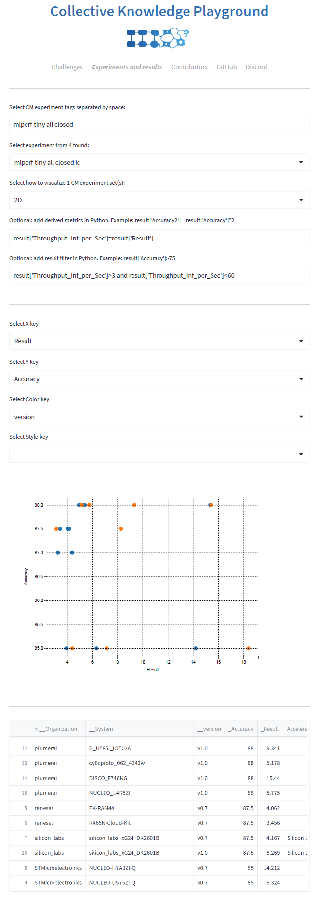

[ [Back to index](../../../docs/README.md) ]

<details>
<summary>Click here to see the table of contents.</summary>

* [CM "experiment" automation](#cm-"experiment"-automation)
  * [Introducing CM experiment automation](#introducing-cm-experiment-automation)
  * [Installing CM with ResearchOps/DevOps/MLOps automations](#installing-cm-with-researchops/devops/mlops-automations)
  * [Understanding CM experiments](#understanding-cm-experiments)
  * [Exploring combinations of parameters (autotuning, design space exploration)](#exploring-combinations-of-parameters-autotuning-design-space-exploration)
  * [Aggregating and unifying results](#aggregating-and-unifying-results)
  * [Visualizing results](#visualizing-results)
  * [Sharing experiments with the community](#sharing-experiments-with-the-community)
  * [Running CM experiments with CM scripts](#running-cm-experiments-with-cm-scripts)
  * [Further community developments](#further-community-developments)

</details>

# CM "experiment" automation

*We suggest you to check [CM introduction](https://github.com/mlcommons/ck/blob/master/docs/introduction-cm.md), 
 [CM CLI/API](https://github.com/mlcommons/ck/blob/master/docs/interface.md) 
 and [CM scripts](../script/README-extra.md) to understand CM motivation and concepts.
 You can also try [CM tutorials](https://github.com/mlcommons/ck/blob/master/docs/tutorials/README.md) 
 to run some applications and benchmarks on your platform using CM scripts.*

## Introducing CM experiment automation


Researchers, engineers and students spend considerable amount of their time experimenting with 
many different settings of applications, tools, compilers, software and hardware 
to find the optimal combination suitable for their use cases.

Based on their feedback, our [MLCommons taskforce on automation and reproducibility](https://github.com/mlcommons/ck/blob/master/docs/taskforce.md) 
started developing a CM automation called "experiment". 
The goal is to provide a common interface to run, record, share, visualize and reproduce experiments
on any platform with any software, hardware and data.

The community helped us test a prototype of our "experiment" automation to record results in a unified CM format 
from [several MLPerf benchmarks](https://github.com/mlcommons/cm4mlperf-results) 
including [MLPerf inference](https://github.com/mlcommons/inference) and [MLPerf Tiny](https://github.com/mlcommons/tiny),
visualize them at the [MLCommons CM platform](https://access.cknowledge.org/playground/?action=experiments&tags=all),
and improve them by the community via [public benchmarking, optimization and reproducibility challenges](https://access.cknowledge.org/playground/?action=challenges).


## Installing CM with ResearchOps/DevOps/MLOps automations

This CM automation is available in the most commonly used `mlcommons@ck` repository. 

First, install CM automation language as described [here](https://github.com/mlcommons/ck/blob/master/docs/installation.md).
Then, install or update this repository as follows:
```bash
cm pull repo mlcommons@ck
```

You can now test that CM experiment automation is available as follows:
```bash
cm run experiment --help
```
or using `cme` shortcut in CM V1.4.1+
```bash
cme --help
```


## Understanding CM experiments

CM experiment simply wraps any user command line, creates an associated CM `experiment` artifact with a random ID (16 low case HEX characters) 
and some user tags in `_cm.json`, creates extra `{date}{time}` subdirectory with `cm-input.json` file with CM input, 
and executes the user command line inside an extra subdirectory with another random ID as shown below.

The following command will print "Hello World!" while recording all the provenance in CM format in the local CM repository:

```bash
cme --tags=my,experiment,hello-world -- echo "Hello World!"
```
or
```bash
cm run experiment --tags=my,experiment,hello-world -- echo "Hello World!"
```

You should see the output similar to the following:
```bash

Path to CM experiment artifact: C:\Users\gfursin\CM\repos\local\experiment\b83a1fb24dbf4945
Path to experiment: C:\Users\gfursin\CM\repos\local\experiment\b83a1fb24dbf4945\2023-06-09.09-58-02.863466
================================================================
Experiment step: 1 out of 1

Path to experiment step: C:\Users\gfursin\CM\repos\local\experiment\b83a1fb24dbf4945\2023-06-09.09-58-02.863466\7ed0ea0edd6b4dd7

"Hello World!"
```

You can find and explore the newly created CM artifact as follows:
```bash
cm find experiment --tags=my,experiment,hello-world
```
or using UID
```bash
cm find experiment b83a1fb24dbf4945
```

When running the same experiment again, CM will find existing artifact by tags and create new {date}{time} directory there:
```bash
cme --tags=my,experiment,hello-world -- echo "Hello World!"

Path to CM experiment artifact: C:\Users\gfursin\CM\repos\local\experiment\b83a1fb24dbf4945
Path to experiment: C:\Users\gfursin\CM\repos\local\experiment\b83a1fb24dbf4945\2023-06-09.10-02-08.911210
================================================================
Experiment step: 1 out of 1

Path to experiment step: C:\Users\gfursin\CM\repos\local\experiment\b83a1fb24dbf4945\2023-06-09.10-02-08.911210\7ed0ea0edd6b4dd7

"Hello World!"
```

You can now replay this experiment as follows:
```bash
cm replay experiment --tags=my,experiment,hello-world
```

Note that you can obtain current directory where you called CM 
(rather than the CM experiment artifact directory) via {{CD}} variable as follows:
```bash
cme --tags=my,experiment,hello-world -- echo {{CD}}
```

You can also record experiments in another CM repository instead of the `local` one as follows:
```bash
cm list repo
cme {CM repository from above list}: --tags=my,experiment,hello-world -- echo {{CD}}
```

Finally, you can force a specific artifact name instead of some random ID as follows:
```bash
cme {my experiment artifact name} --tags=my,experiment,hello-world -- echo {{CD}}
```
or with given repository
```bash
cme {CM repository from above list}:{my experiment artifact name} --tags=my,experiment,hello-world -- echo {{CD}}
```

## Exploring combinations of parameters (autotuning, design space exploration)

One of the most common tasks is computer engineering (and other sciences)
is to explore various combinations of parameters of some applications 
and systems to select the optimal ones to trade off performance, accuracy, 
power consumption, memory usage and other characteristics.

As a starting point, we have implemented a very simple explorer as a Cartesian product
of any number of specified variables that are passed to a user command line via double curly braces `{{VAR}}` similar to GitHub.

You just need to create a simple JSON file `cm-input.json` to describe sets/ranges for each variable as follows:
```json
{
  "explore": {
    "VAR1": [
      1,
      2,
      3
    ],
    "VAR2": [
      "a",
      "b"
    ],
    "VAR3": "[2**i for i in range(0,6)]"
  }
}
```

or YAML `cm-input.yaml`:

```yaml
explore:
  VAR1: [1,2,3]
  VAR2: ["a","b"]
  VAR3: "[2**i for i in range(0,6)]"
```

You can then run the following example to see all iterations:
```bash
cm run experiment --tags=my,experiment,hello-world @test_input.yaml \
     -- echo %VAR1% --batch_size={{VAR1}} {{VAR2}} {{VAR4{['xx','yy','zz']}}}-%%VAR3%%
```

Note that you can also define a Python list of range for other variables 
directly in the command line as demonstrated in above example for `VAR4` - `{{VAR4{['xx','yy','zz']}}}`.

CM will create or reuse experiment artifact with tags `my,experiment,hello-world`
and will then iterate in a Cartesian product of all detected variables.

For each iteration, CM will create a `{date}{time}` subdirectory in a given experiment artifact
and will then run a user command line with substituted variables there.

You can then replay any of the exploration experiment as follows:
```bash
cm replay experiment --tags={tags} --dir={sub directory}
```


## Aggregating and unifying results

Users can expose any information such as measured characteristics of their applications and/or systems (performance,
hardware or OS state, accuracy, internal parameters, etc) to CM for further analysis and visualization 
by generating a JSON `cm-result.json` file with any dictionary.

If this file exists after executing a user command, CM will load it after each experiment or exploration step, 
and merge it with a list in a common `cm-result.json` in `{date}{time}` directory for this experiment.


## Visualizing results

Users can now visualize multiple experiments using the CM GUI script as follows:
```bash
cm run script "gui _graph" --exp_tags=my,experiment,hello-world
```

This script will search for all CM experiment entries with these tags, read all `cm-result.json` files,
detect all keys used in result dictionaries, let users select these keys for X and Y axes 
to prepare a 2D graph using a popular [StreamLit library](https://streamlit.io), add derived metrics and set constraints
as shown in the following example for one of the official [Tiny MLPerf submissions](https://github.com/mlcommons/tiny):




## Sharing experiments with the community

It is possible to share experiments with a common automation interface
in your own GitHub/GitLab repository, container and zip/tar file
in a non-intrusive way. 

You need to go to a root directory of your project and initialize CM repository there
with a unique name "my-cool-project" as follows:

```bash
cm init repo my-cool-project --path=. --prefix=cmr
```

This command will create a `cmr.yaml` file with a description and unique ID of this repository,
and will register it in the CM. Note that all CM automations and artifacts will be located
in the `cmr` sub-directory to avoid contaminating your project. They can be deleted
or moved to another project at any time.

You can now record new experiments in this repository by adding `my-cool-project:` to the cm experiment command line as follows:
```bash
cm run experiment my-cool-project: --tags=my,experiment,hello-world -- echo "Hello World!"
```

You can also move a set of existing experiments from the `local` CM repository to the new one as follows:
```bash
cm move experiment my-cool-project: --tags=my,experiment,hello-world 
```

You can continue replaying these experiments in the way no matter what CM repository they are in:
```bash
cm replay experiment --tags=my,experiment,hello-world
```

or you can enforce a specific repository as follows:
```bash
cm replay experiment my-cool-project: --tags=my,experiment,hello-world
```


## Running CM experiments with CM scripts

User scripts and tools may contain some hardwired local paths that may prevent replaying them on another platform.
In such case, we suggest you to use [CM scripts](/../script/README-extra.md). 

CM scripts solve this problem by wrapping existing user scripts and tools and detecting/resolving paths
to specific tools and artifacts on a given user platform.

You can find example of using CM scripts with CM experiments in [this directory](tests) - see `test3.bat` or `test3.sh`:
```bash
cm run experiment --tags=test @test3_input.yaml -- cm run script "print hello-world native" --env.CM_ENV_TEST1={{VAR1}} --const.CM_ENV_TEST2={{VAR2}}
```

You can use the following environment variables to pass the current path, 
different paths to experiment entries and the number of experiment to your CM script:
* {{CD}}
* {{CM_EXPERIMENT_STEP}}
* {{CM_EXPERIMENT_PATH}}
* {{CM_EXPERIMENT_PATH2}}
* {{CM_EXPERIMENT_PATH3}}


Feel free to check [this tutorial](../../../docs/tutorials/common-interface-to-reproduce-research-projects.md)
to add CM scripts for your own applications, tools and native scripts.

We are currently extending CM experiments and CM scripts for MLPerf benchmarks 
to automate benchmarking, optimization and design space exploration of ML/AI systems 
on any software and hardware - please stay tuned via our [Discord server](https://discord.gg/JjWNWXKxwT).


## Further community developments

We are developing this experiment automation in CM to help the community share, reproduce and reuse experiments 
using a common, simple, human readable, and portable [automation language](../../../docs/README.md).

Join our [Discord server](https://discord.gg/JjWNWXKxwT) from the [MLCommons task force on automation and reproducibility](../taskforce.md)
to participate in the unification and extension of this interface and CM scripts for diverse research projects and tools.

