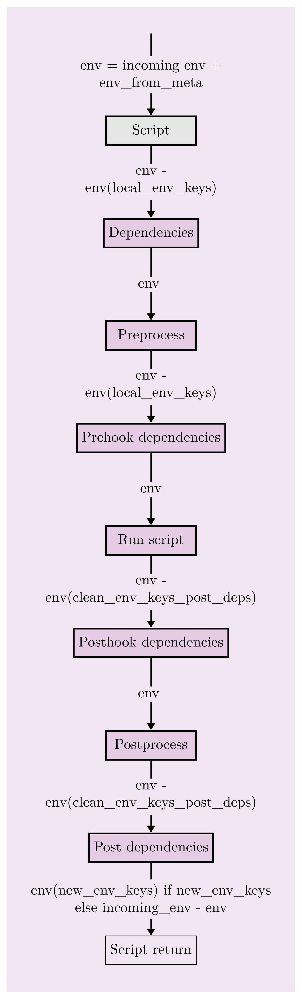

# CM "script" automation specification

Please check the [CM documentation](https://github.com/mlcommons/ck/tree/master/docs#collective-mind-language-cm)
for more details about the CM automation language.

See the CM script introduction [here](README-extra.md).

See the [automatically generated catalog](https://github.com/mlcommons/ck/blob/master/docs/list_of_scripts.md) of all CM scripts from MLCommons.

## Getting started with CM scripts

* A CM script is identified by a set of tags and by unique ID. 
* Further each CM script can have multiple variations and they are identified by variation tags which are treated in the same way as tags and identified by a `_` prefix.

### CM script execution flow
* When a CM script is invoked (either by tags or by unique ID), its `_cm.json` is processed first which will check for any `deps` script and if there are, then they are executed in order.
* Once all the `deps` scripts are executed, `customize.py` file is checked and if existing `preprocess` function inside it is executed if present. 
* Then any `prehook_deps` CM scripts mentioned in `_cm.json` are executed similar to `deps`
* After this, keys in `env` dictionary is exported as `ENV` variables and `run` file if exists is executed.
* Once run file execution is done, any `posthook_deps` CM scripts mentioned in `_cm.json` are executed similar to `deps`
* Then `postprocess` function inside customize.py is executed if present.
* After this stage any `post_deps` CM scripts mentioned in `_cm.json` is executed.

** If a script is already cached, then the `preprocess`, `run file` and `postprocess` executions won't happen and only the dependencies marked as `dynamic` will be executed from `deps`, `prehook_deps`, `posthook_deps` and `postdeps`.

### Input flags
When we run a CM script we can also pass inputs to it and any input added in `input_mapping` dictionary inside `_cm.json` gets converted to the corresponding `ENV` variable.

### Conditional execution of any `deps`, `post_deps`
We can use `skip_if_env` dictionary inside any `deps`, `prehook_deps`, `posthook_deps` or `post_deps` to make its executional conditional

### Versions
We can specify any specific version of a script using `version`. `version_max` and `version_min` are also possible options. 
* When `version_min` is given, any version above this if present in the cache or detected in the system can be chosen. If nothing is detected `default_version` if present and if above `version_min` will be used for installation. Otherwise `version_min` will be used as `version`.
* When `version_max` is given, any version below this if present in the cache or detected in the system can be chosen. If nothing is detected `default_version` if present and if below `version_max` will be used for installation. Otherwise `version_max_usable` (additional needed input for `version_max`) will be used as `version`.

### Variations
* Variations are used to customize CM script and each unique combination of variations uses a unique cache entry. Each variation can turn on `env` keys also any other meta including dependencies specific to it. Variations are turned on like tags but with a `_` prefix. For example, if a script is having tags `"get,myscript"`, to call the variation `"test"` inside it, we have to use tags `"get,myscript,_test"`. 
 
#### Variation groups
`group` is a key to map variations into a group and at any time only one variation from a group can be used in the variation tags. For example, both `cpu` and `cuda` can be two variations under the `device` group, but user can at any time use either `cpu` or `cuda` as variation tags but not both.

#### Dynamic variations
Sometimes it is difficult to add all variations needed for a script like say `batch_size` which can take many different values. To handle this case, we support dynamic variations using '#' where '#' can be dynamically replaced by any string. For example, `"_batch_size.8"` can be used as a tag to turn on the dynamic variation `"_batch_size.#"`.

### ENV flow during CM script execution
* [TBD] Issue added [here](https://github.com/mlcommons/ck/issues/382)
* During a given script execution incoming `env` dictionary is saved `(saved_env)` and all the updates happens on a copy of it.
* Once a script execution is over (which includes all the dependent script executions as well), newly created keys and any updated keys are merged with the `saved_env` provided the keys are mentioned in `new_env_keys`
* Same behaviour applies to `state` dictionary.

#### Special env keys
* Any env key with a prefix `CM_TMP_*` and `CM_GIT_*` are not passed by default to any dependency. These can be force passed by adding the key(s) to the `force_env_keys` list of the concerned dependency. 
* Similarly we can avoid any env key from being passed to a given dependency by adding the prefix of the key in the `clean_env_keys` list of the concerned dependency.
* `--input` is automatically converted to `CM_INPUT` env key
* `version` is converted to `CM_VERSION`, ``version_min` to `CM_VERSION_MIN` and `version_max` to `CM_VERSION_MAX`
* If `env['CM_GH_TOKEN']=TOKEN_VALUE` is set then git URLs (specified by `CM_GIT_URL`) are changed to add this token.
* If `env['CM_GIT_SSH']=yes`, then git URLs are changed to SSH from HTTPS.

### Script Meta
#### Special keys in script meta
* TBD: `reuse_version`, `inherit_variation_tags`, `update_env_tags_from_env`

### How cache works?
* If `cache=true` is set in a script meta, the result of the script execution is cached for further use. 
* For a cached script, `env` and `state` updates are done using `new_env` and `new_state` dictionaries which are stored in the `cm-cached.json` file inside the cached folder.
* By using `--new` input, a new cache entry can be forced even when an old one exist. 
* By default no depndencies are run for a cached entry unless `dynamic` key is set for it. 

### Updating ENV from inside the run script
* [TBD]

### Script workflow (env, deps, native scripts)

&copy; 2022-23 [MLCommons](https://mlcommons.org) 
