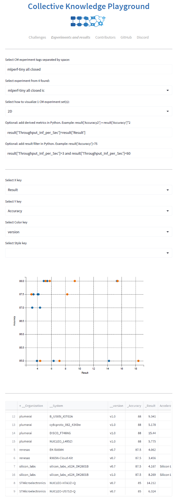

# About

This portable script converts raw results from the [TinyMLPerf™ benchmark]( https://github.com/mlcommons/tiny )
to the [MLCommons CM format](https://github.com/mlcommons/ck) for the [Collective Knowledge Playground](https://x.cKnowledge.org).

The goal is to make it easier for the community to analyze MLPerf inference results, 
add derived metrics such as performance/Watt and constraints,
and link reproducibility reports as shown in these examples:
* [Power efficiency to compare Qualcomm, Nvidia and Sima.ai devices](https://cKnowledge.org/mlcommons-mlperf-inference-gui-derived-metrics-and-conditions)
* [Reproducibility report for Nvidia Orin](https://access.cknowledge.org/playground/?action=experiments&name=mlperf-inference--v3.0--edge--closed--image-classification--offline&result_uid=3751b230c800434a)

Aggreaged results are available in [this MLCommons repository](https://github.com/mlcommons/cm4mlperf-results).

You can see these results at [MLCommons CK playground](You can see aggregated results [here](https://access.cknowledge.org/playground/?action=experiments&tags=mlperf-tiny,all).

## Usage

We have tested this portable CM script on Ubuntu and Windows.

Install [MLCommons CM framework](https://github.com/mlcommons/ck/blob/master/docs/installation.md).

Pull the MLCommons CK repository with automation recipes for interoperable MLOps:
```bash
cm pull repo mlcommons@ck
```

Install repositories with raw MLPerf inference benchmark results:
```bash
cm run script "get git repo _repo.https://github.com/mlcommons/tiny_results_v0.7" --extra_cache_tags=mlperf-tiny-results,version-0.7
cm run script "get git repo _repo.https://github.com/mlcommons/tiny_results_v1.0" --extra_cache_tags=mlperf-tiny-results,version-1.0
cm run script "get git repo _repo.https://github.com/mlcommons/tiny_results_v1.1" --extra_cache_tags=mlperf-tiny-results,version-1.1
````

You can also add private results to compare submissions locally before they become public:
```bash
cm run script "get git repo _repo.https://github.com/mlcommons/submissions_tiny_v1.1" --extra_cache_tags=mlperf-tiny-results,version-1.1-private
```

You can use a specific checkout/branch as follows:
```bash
cm run script "get git repo _repo.https://github.com/mlcommons/submissions_tiny_v1.1" \
   --extra_cache_tags=mlperf-tiny-results,version-1.1-private,generate_final_report \
   --depth="" \
   --branch=generate_final_report
```

Convert raw MLPerf results into CM experiment entries:
```bash
cm run script "import mlperf tiny to-experiment"
```

Visualize results on your local machine via CK playground GUI:
```bash
cm run script "gui _graph" --exp_tags=mlperf-tiny
```

You can then select the results you want to visualize and compare,
add derived metrics and set constaints as shown in the following example:




These results are also available in the [public CK playground](https://access.cknowledge.org/playground/?action=experiments&tags=mlperf-tiny,all).

# Contact us

This project is maintained by the [MLCommons taskforce on automation and reproducibility](https://cKnowledge.org/mlcommons-taskforce).
Join our [Discord server](https://discord.gg/JjWNWXKxwT) to ask questions, provide your feedback and participate in further developments.
