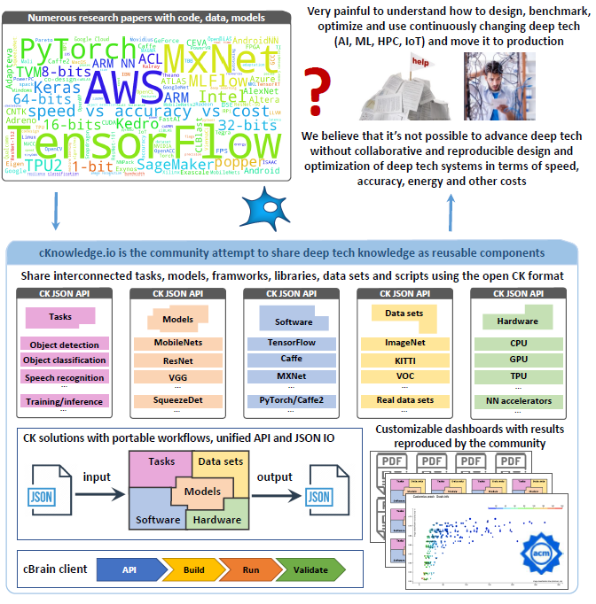

# Introduction

## What is the Collective Knowledge project (CK)

Developing complex computational systems for emerging workloads (ML, AI,
Quantum, IoT) and moving them to production is a very tedious, ad-hoc and
time consuming process due to continuously changing software, hardware,
models, data sets and research techniques.

After struggling with these problems for many years, we started the *Collective Knowledge project (CK)*
to decompose complex systems and research projects 
into [reusable, portable, customizable and non-virtualized CK components](https://cKnowledge.io/browse) 
with the unified [automation actions, Python APIs, CLI and JSON meta description](https://cKnowledge.io/actions).

Our idea is to gradually abstract all existing artifacts (software, hardware, models, data sets, results)
and use the DevOps methodology to connect such components together 
into [functional solutions](https://cKnowledge.io/demo)
that can automatically adapt to evolving models, data sets and bare-metal platforms
with the help of [customizable program workflows](https://cKnowledge.io/programs),
a list of [all dependencies](https://cknowledge.io/solution/demo-obj-detection-coco-tf-cpu-benchmark-linux-portable-workflows/#dependencies)
(models, data sets, frameworks), and a portable 
[meta package manager](https://cKnowledge.io/packages).

CK is basically our intermediate language to connect researchers and practitioners 
to collaboratively design, benchmark, optimize and validate innovative computational systems.
It then makes it possible to find the most efficient system configurations
on a [Pareto frontier](https://cKnowledge.org/request)
(trading off speed, accuracy, energy, size and different costs)
using an [open repository of knowledge](https://cKnowledge.io)
with [live SOTA scoreboards](https://cKnowledge.io/sota)
and [reproducible papers](https://cKnowledge.io/reproduced-papers).

We hope that such approach will make it possible 
to better understand [what is happening]( https://cknowledge.io/solution/demo-obj-detection-coco-tf-cpu-benchmark-linux-portable-workflows/#dependencies ) 
inside complex and "black box" computational systems,
integrate them with production and legacy systems,
use them inside Docker and Kubernetes,
share them along with [published papers](https://cKnowledge.io/events),
and apply the DevOps methodology in deep tech research and computational science.
We also use CK to complement related reproducibility initiatives
including [MLPerf](https://mlperf.org), 
[PapersWithCode](https://paperswithcode.com),
[ACM artifact review and badging](https://www.acm.org/publications/policies/artifact-review-badging)
and [artifact evaluation](https://cTuning.org/ae).

See the [real CK use cases from our partners](https://cKnowledge.org/partners.html)
and try our [MLPerf automation demo](https://cKnowledge.io/demo) on your platform.
You can learn more about our project in this documentation and 
the following presentations and white papers: 
[2019]( https://doi.org/10.5281/zenodo.2556147 ),
[2018]( https://cknowledge.io/c/report/rpi3-crowd-tuning-2017-interactive ),
[2017]( https://www.slideshare.net/GrigoriFursin/enabling-open-and-reproducible-computer-systems-research-the-good-the-bad-and-the-ugly ),
[2009]( https://hal.inria.fr/inria-00436029v2 ).

*Even though the CK technology is used [in production](https://cKnowledge.org/partners.html) for more than 5 years, it is still a proof-of-concept prototype requiring further improvements and standardization. Depending on the available resources, we plan to develop a new, backward-compatible and more user-friendly version - please [get in touch](https://cKnowledge.org/contacts.html) if you are interested to know more!*

## Glossary

### CK framework

The **[CK framework](https://github.com/ctuning/ck)** is a low-level CLI-based SDK 
to share [reusable CK components](https://cKnowledge.io/browse)
and [R&D automation actions](https://cKnowledge.io/actions) 
in a human-readable format with a unified CLI, Python API, and JSON meta descriptions.

### CK portal

The **[CK portal](https://cKnowledge.io)** is an open platform to share and interconnect reusable CK components 
(models, data sets, packages, scripts) from research projects in the [common CK format](https://github.com/ctuning/ck)
required to enable portable, customizable and reproducible benchmarking pipelines.

### CK component

A **[CK component](https://cKnowledge.io/browse)** is an abstraction of any existing artifact (code, model, data set, script, result)
consisting of a CK module, CK data and a collection of native files and directories from a given artifact. See the example
of a CK package component "package:compiler-llvm-8.0.0-universal" at [GitHub](https://github.com/ctuning/ck-env/tree/master/package/compiler-llvm-8.0.0-universal)
and on [cKnowledge.io platform](https://cknowledge.io/c/package/compiler-llvm-8.0.0-universal)

  * **[CK module](https://cKnowledge.io/modules)** provides a unified Python API with JSON input/output 
    and a Command Line Interface for a given computational component.
  * **CK data** provides a unified JSON meta description of a given
    computational component and connects it with native files and directories of this component.
    * **CK UID** is a unique ID of 16 lowercase hexadecimal digits automatically assigned 
      to all CK modules and data during creation. This is needed to keep track of all distributed components.
    * **CK UOA** is an abbreviation when one can use **U**nique ID **O**r **A**lias where alias
      is a user-friendly name of a given module and data.
    * **CID** is a combination of {module UOA}:{data UOA} to uniquely identify and find any CK component.
  * **[CK action](https://cKnowledge.io/action)** describes all public automation functions from a given CK module
    applied to a given CK data 

  * **[CK soft components](https://cKnowledge.io/soft)** automatically detect required 
    software for a given computational system on a given platform (models, data sets, frameworks, libraries ...)
  * **[CK package components](https://cKnowledge.io/package)** automatically install 
    missing software for a given computational system on a given platform (models, data sets, frameworks, libraries ...)

### CK repository

A **[CK repository](https://cKnowledge.io/repos)** is a directory with a collection of CK components.
After such a repository is installed by CK, a user has a unified access to all new CK components 
inside this repository. Such repository receives the following badge on GitHub:

### Reproducible benchmarking pipeline and autotuning workflow

The **[Reproducible benchmarking pipeline](https://cKnowledge.io/programs)**

The unified API and JSON meta of all CK components allow us to connect them 
into [customizable benchmarking pipelines](https://hal.inria.fr/hal-01054763). 
It is also possible to expose all design
and optimization parameters of all components (models, frameworks, compilers, run-time systems, hardware)
in a unified way and enable complete system autotuning to find the most efficient
solutions on a Pareto frontier in terms of speed, accuracy, energy and other costs
also exposed via unified APIs. 
Furthermore, unified APIs allow one to keep track of all information passed between
components to ensure reproducibility of results.

See how CK was used to [autotune ML models for MLPerf submission](https://cknowledge.io/c/result/crowd-benchmarking-mlperf-inference-classification-mobilenets-all)
and for [reproducible and Pareto-efficient ML/SW/HW co-design tournaments](https://cKnowledge.org/request).

### cBench

**[cBench](https://github.com/ctuning/cbench)** is a wrapper around the low-level CK SDK 
to connect it with the CK portal while improving and simplifying the user experience
during collaborative benchmarking and optimization of complex computational systems.

### Live SOTA dashboards

**[Live SOTA dashboards](https://cKnowledge.io/results)** are connected with cBench 
to aggregate information about the behavior of computational systems across diverse
software, hardware, models and data sets similar to SETI@home. They are also used
for our [reproducibility initiatives](https://cKnowledge.io/events) 
to validate results from published papers at [systems and ML conferences](https://cTuning.org/ae).

### Reproduced research papers

**[Reproduced research papers](https://cKnowledge.io/reproduced-papers)** are published on our portal
if it was reproduced using the [standard ACM/cTuning evaluaiton procedure](https://cTuning.org/ae) 
with the [unified Artifact Appendix and reproducibility checklist](https://ctuning.org/ae/submission_extra.html)
which we helped to prepare in collaboration with the [ACM taskforce on reproducibility](https://www.acm.org/publications/task-force-on-data-software-and-reproducibility).

### Portable CK solution

A **[Portable CK solution](https://cKnowledge.io/c/solution)** is a set of JSON files describing 
how to download, build, benchmark and use AI, ML, quantum, IoT and other emerging technologies
across diverse hardware, software, models and data sets. It includes:

* a portable and reproducible [program pipeline (workflow)](https://cKnowledge.io/programs) with a unified interface to build and run this system (see above);
* [all necessary dependencies](https://cknowledge.io/solution/demo-obj-detection-coco-tf-cpu-benchmark-linux-portable-workflows/#dependencies) 
  on [portable CK components](https://cKnowledge.io/browse) (code, data, models)];
* a universal autotuning workflow to optimize the whole system;
* a convention about how to benchmark this system and reproduce results;
* an associated [SOTA scoreboard](https://cKnowledge.io/results) for collaborative benchmarking and optimization of related systems; 

We need it to provide a common format for research code and results 
shared along with [published papers](https://cknowledge.io/papers) 
during our [reproducibility initiatives](https://cknowledge.io/events)
for systems and ML conferences. 

### CK solutions for MLPerf

**[CK portable solutions for MLPerf](https://cKnowledge.io/c/solution/demo-obj-detection-coco-tf-cpu-benchmark-linux-portable-workflows/)** 
demonstrates how to use our CK solutions with cBench 
to automatically build, run and [crowd-benchmark](https://cKnowledge.io/result/sota-mlperf-object-detection-v0.5-crowd-benchmarking/) 
object detection based on [SSD-Mobilenets, TensorFlow and COCO dataset](https://cKnowledge.io/solution/demo-obj-detection-coco-tf-cpu-benchmark-linux-portable-workflows/#dependencies)
from the latest [MLPerf inference benchmark](https://mlperf.org) across a wide range of platforms 
from Raspberry Pi, Android phones and IoT devices to HPC servers with GPUs.

### The meaning behind the "c"

**The lowercase c (cKnowledge, cBench, cTuning)** means "collective", "collaborative" or "crowd" based on our vision
of collaborative and reproducible benchmarking and optimization of complex computational systems:
[2009]( https://en.wikipedia.org/wiki/Collective_Tuning_Initiative ),
[2017]( https://www.slideshare.net/GrigoriFursin/enabling-open-and-reproducible-computer-systems-research-the-good-the-bad-and-the-ugly ),
[2018]( https://cknowledge.io/c/report/rpi3-crowd-tuning-2017-interactive ),
[2019]( https://doi.org/10.5281/zenodo.2556147 ).

## Why CK?

The CK project was heavily motivated by our [painful experience](https://www.slideshare.net/GrigoriFursin/enabling-open-and-reproducible-computer-systems-research-the-good-the-bad-and-the-ugly-) 
validating innovative ideas from research papers
at [ML and systems conferences](https://cKnowledge.io/reproduced-results) 
and moving them to production.
We have noticed that while finding the code from research papers 
is not a problem anymore thanks to [ArXiv](https://arxiv.org),
[PapersWithCode](https://PapersWithCode.com) and [MLPerf](https://mlperf.org), 
it is only a small tip of the iceberg.
The major challenge afterwards is to figure out how to
find and connect all compatible dependencies (code, data, models)
for numerous and rapidly evolving heterogeneous systems 
with continuously changing interfaces and data formats,
integrate them with complex applications,
customize them and run them in the most efficient way.

Existing useful tools such as MLFlow, Kedro and Amazon SageMaker
help to automate training and other high-level ML operations 
while Docker, Kubernetes and other
container based tools can hide software chaos 
but there is a lack of an intermediate framework and format
to bridge the growing gap between deep tech research 
and real computer systems, particularly
when targeting resource constrained embedded devices and IoT!

All these problems motivated [Grigori Fursin](https://cKnowledge.org) 
to start the Collective Knowledge Project
and pursue his vision 
of the collaborative and reproducible development of efficient computational systems (AI, ML, quantum, IoT)
with the help of a common research SDK, an <a href="https://cKnowledge.io">open repository of knowledge</a>
and collaborative validation of research results from <a href="https://cKnowledge.io/reproduced-papers">published papers</a>
([2009](https://en.wikipedia.org/wiki/Collective_Tuning_Initiative"),
 [2014](https://cTuning.org/ae"),
 [2017](https://www.slideshare.net/GrigoriFursin/enabling-open-and-reproducible-computer-systems-research-the-good-the-bad-and-the-ugly"),
 [2019](https://doi.org/10.5281/zenodo.2556147"),
 [2020](https://arxiv.org/abs/2006.07161)).

The idea is to help the community exchange all the basic blocks (CK components) 
needed to assemble portable workflows for complex systems, collaboratively benchmark them 
and compare their performance using [live SOTA scoreboards](https://cKnowledge.io/reproduced-results).

One of the current practical applications  of the CK technology 
is to enable portable MLSysOps, i.e. cross-platform [MLOps](https://en.wikipedia.org/wiki/MLOps)
with the automated deployment of ML models in production across diverse systems
from IoT to data centers in the most efficient way.

We also work with the community to reproduce and compare SOTA results from AI, ML and systems research 
using our (<a href="https://cKnowledge.io/solutions">CK solutions</a>) 
with a common API (compile, run, benchmark, validate) in terms
of speed, accuracy, latency, energy usage, memory consumption and costs.

## Why open CK format?

We have been working on a common format for collaborative benchmarking and optimization
since [2009](https://en.wikipedia.org/wiki/Collective_Tuning_Initiative).
In 2015 we prototyped the new, open and human-readable CK format 
to share computational components and workflows.
It turned out to be flexible and customizable enough 
to support many [real use cases] from our academic and industrial partners.
For example, the authors of 15+ research papers from
different [systems and ML conferences](https://cTuning.org/ae) used CK to share their
[research code, data and results](https://cKnowledge.io/?q="portable-workflow-ck").

CK concept is to gradually convert ad-hoc research projects into
file-based databases of [reusable components](https://cKnowledge.io/c/module)
including code, data, models, pre-/post-processing scripts,
experimental results, best research practices to reproduce
results, and [auto-generated papers](https://cKnowledge.io/?q=%22live-paper%22) 
with unified Python APIs, 
[CLI-based automation actions](https://cKnowledge.io/c/ck-action)
and JSON meta information.

CK also features plugins to [automatically detect](https://cKnowledge.io/c/soft) different software, models 
and data sets on a user machine and [install the missing ones](https://cKnowledge.io/c/package)
 while supporting different operating
systems (Linux, Windows, MacOS, Android) and heterogeneous hardware from all major vendors
including Intel, Arm, Nvidia and AMD.

Such approach allows researchers and practitioners to create and share
flexible APIs with JSON input/output for different AI/ML
frameworks, libraries, compilers, models and data sets,
and connect them together into [portable and unified workflows](https://cKnowledge.io/c/program)
instead of hardwired scripts and data formats.

## Our goals and plans

Even though the CK technology is <a href="https://cKnowledge.org/partners.html">stable and used in production</a>,
there is still a lot to be done and we are only at the beginning of this long-term project. 

We continue improving cBench as a more user-friendly wrapper around CK,
and we continue improving the open cKnowledge.io portal as a centralized
place to aggregate, version, test and create all components
and workflows necessary to design complex computational systems.

We are making a special effort to ensure that the CK technology is non-intrusive,
i.e. that it complements, abstracts and interconnects all existing tools
including MLFlow, MLPerf, Docker, Kubernetes, GitHub actions making
them more system aware rather than replacing or rewriting them.

Our goal is to help researchers and practitioners to collaboratively
validate innovative techniques, benchmark and optimize novel computational
systems, and find the most efficient ones in terms of speed, accuracy,
energy, size and different costs using a [public repository of knowledge](https://cKnowledge.io/browse)
with [live SOTA scoreboards](https://cKnowledge.io/results) 
and [reproducible papers](https://cKnowledge.io/reproduced-papers).

Based on your feedback we plan to add the following features to our platform in 2020:
* GUI to add, test and interconnect computational components (software detection plugins, meta packages, pre/post-processing scripts)
* GUI to assemble portable solutions from above components to be able to adapt computational systems to evolving hardware and software
* GUI for automated [MLPerf benchmark submissions and validations](https://mlperf.org) across diverse systems, models and data set (see our [proof-of-concept demo](https://cKnowledge.io/demo))
* Continuous testing of all shared components and portable workflows
* Improved SOTA scoreboards to support [reproducibility initiatives and optimization tournaments/hackathons]( https://cKnowledge.io/events ) 
* Improved SOTA scoreboards to [reproduce and crowd-benchmark AI/ML solutions](https://cKnowledge.io/reproduced-results) from [SOTA papers]( https://cknowledge.io/c/lib/ ).
