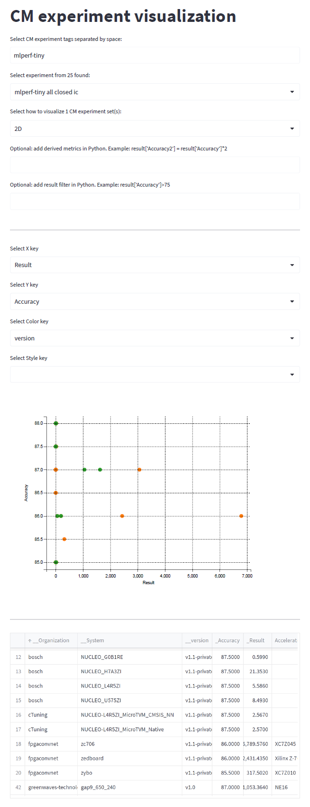

[ [Back to index](../README.md) ]

# Tutorial: automate TinyMLPerf benchmark

The [MLCommons task force on automation and reproducibility](https://github.com/mlcommons/ck/blob/master/docs/taskforce.md)
is developing an [open-source Collective Knowledge platform](https://access.cknowledge.org/playground/?action=experiments&tags=mlperf-tiny)
to make it easier for the community to run, visualize and optimize MLPerf benchmarks 
out of the box across diverse software, hardware, models and data.

This tutorial demonstrates how to automate a common setup for the [Tiny MLPerf benchmark](https://github.com/mlcommons/tiny)
and [EEMBC Energy runner](https://github.com/eembc/energyrunner) with the help 
of the [MLCommons CM automation language](https://github.com/mlcommons/ck/blob/master/docs/README.md)
on Linux or Windows.

If you have any questions about this tutorial, please get in touch via our public [Discord server](https://discord.gg/JjWNWXKxwT)
or open a GitHub issue [here](https://github.com/mlcommons/ck/issues).

## Install CM automation language

Follow [this guide](https://github.com/mlcommons/ck/blob/master/docs/installation.md) 
to install the MLCommons CM automation language on your platform. 

We have tested this tutorial with Ubuntu 20.04 and Windows 10.

## Install MLCommons CK repository with CM automations

```bash
cm pull repo mlcommons@ck
```

If you have been using CM and would like to have a clean installation,
you can clean CM cache as follows:
```bash
cm rm cache -f
```

## Install Python virtual environment

Since EEMBC Energy Runner and TinyMLPerf data sets require many [specific Python dependencies](https://github.com/mlcommons/ck/blob/master/cm-mlops/script/get-dataset-cifar10/requirements.txt),
we suggest you to install Python virtual environment using CM as follows:

```bash
cm run script "install python-venv" --name=tiny --version_min=3.9
export CM_SCRIPT_EXTRA_CMD="--adr.python.name=tiny"
```

You can find its location in CM cache as follows:
```bash
cm show cache --tags=python-venv
```

## Install EEMBC Energy Runner repository

You can use CM to install the dependencies for the EEMBC Energy Runner 
and prepare a required directory structure for all TinyMLPerf benchmarks using [this CM script](https://github.com/mlcommons/ck/tree/master/cm-mlops/script/get-mlperf-tiny-eembc-energy-runner-src):
```bash
cm run script "get eembc energy-runner src"
```

This CM script will download sources and create an `eembc` directory 
in your $HOME directory on Linux, Windows or MacOs
with partial datasets required by TinyMLPerf.

## Install CIFAR10 for image classification

CIFAR10 data set is not included in EEMBC energy-runner GitHub repo and can be generated on your machine
using [this CM script](https://github.com/mlcommons/ck/tree/master/cm-mlops/script/get-dataset-cifar10):
```bash
cm run script "get dataset cifar10 _tiny"
```

This script will download CIFAR10 data set in the Python (TensorFlow) format 
together with the [TinyMLPerf sources](https://github.com/mlcommons/ck/tree/master/cm-mlops/script/get-mlperf-tiny-src).
It will then generate samples required for EEMBC Energy Runner in the following directory:
`$HOME/eembc/runner/benchmarks/ulp-mlperf/datasets/ic01`

## Setup boards

### STMicroelectronics NUCLEO-L4R5ZI

If you run EEMBC Energy runner on Linux, please check that you have [this rule](https://github.com/stlink-org/stlink/blob/develop/config/udev/rules.d/49-stlinkv2-1.rules) 
installed in `/usr/lib/udev/rules.d`. If not, please copy it there and unplug/replug the board! See [related ticket](https://github.com/mlcommons/ck/issues/606) for more details.


## Download and run EEMBC Energy Runner

Download EEMBC Energy Runner for your platform from [this website](https://www.eembc.org/energyrunner/mlperftiny)
and run it. Normally, you should be able to see and initialize the connected board as described 
[here](https://github.com/eembc/energyrunner#software-setup).


## Build and run TinyMLPerf benchmarks

You can now follow [this tutorial](reproduce-mlperf-tiny.md) to build, flash and run image classification and keyword spotting
benchmarks with MicroTVM, Zephyr and CMSIS on NUCLEO-L4R5ZI. It was prepare for the TinyMLPerf v1.1 submission round
as a part of this [MLCommons community challenge](https://access.cknowledge.org/playground/?action=challenges&name=d98cd66e0e5641f7).

You can then follow [the official README](https://github.com/eembc/energyrunner#README.md) to run benchmarks
in performance, accuracy and energy modes.


## Prepare submission

*We plan to automate TinyMLPerf submission for any hardware/software stack during the next submission round.*


## Visualize and compare results

Please follow [this README](../../cm-mlops/script/import-mlperf-tiny-to-experiment/README-extra.md)
to import TinyMLPerf results (public or private) to the CM format to visualize and compare them
on your local machine while adding derived metrics and providing constraints as shown in the following example:




We publish all public TinyMLPerf results in the [MLCommons CK platform](https://access.cknowledge.org/playground/?action=experiments&tags=mlperf-tiny)
to help the community analyze, compare, reproduce, reuse and improve these results.

The ultimate goal of our [MLCommons task force](../taskforce.md) and the [free MLCommons CK platform](https://access.cknowledge.org)
is to help users automatically generate Pareto-efficient
end-to-end applications using MLPerf results based on their requirements and constraints
(performance, accuracy, energy, hardware/software stack, costs).


## Contact our task force

Please join the [MLCommons task force on automation and reproducibility](https://github.com/mlcommons/ck/blob/master/docs/taskforce.md)
to get free help to automate TinyMLPerf benchmark for your software and hardware stack using the MLCommons CM automation language!
